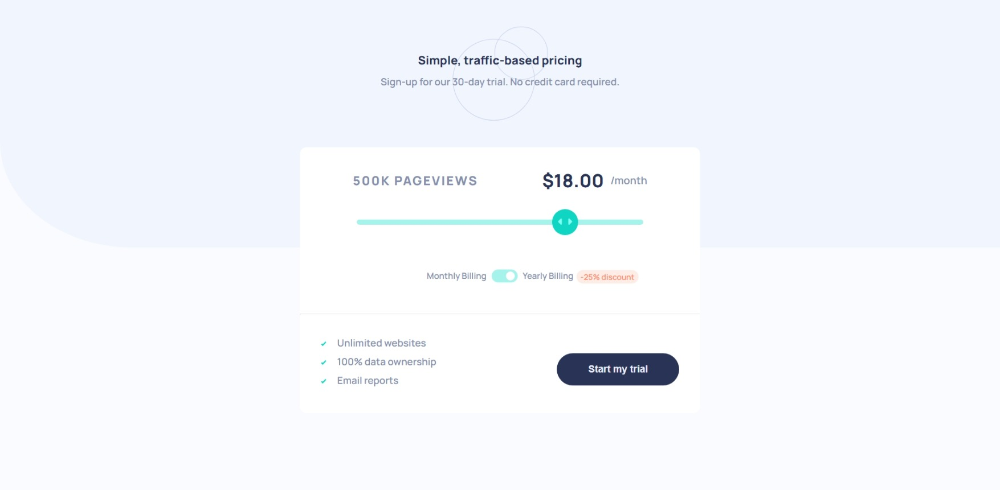

# Frontend Mentor - Interactive pricing component solution

This is a solution to the [Interactive pricing component challenge on Frontend Mentor](https://www.frontendmentor.io/challenges/interactive-pricing-component-t0m8PIyY8). Frontend Mentor challenges help you improve your coding skills by building realistic projects. 

## Table of contents

- [Overview](#overview)
  - [The challenge](#the-challenge)
  - [Screenshot](#screenshot)
  - [Links](#links)
- [My process](#my-process)
  - [Built with](#built-with)
  - [Useful resources](#useful-resources)
- [Author](#author)

## Overview

### The challenge

Users should be able to:

- View the optimal layout for the app depending on their device's screen size
- See hover states for all interactive elements on the page
- Use the slider and toggle to see prices for different page view numbers

### Screenshot

### Links

- Solution URL: [Github](https://github.com/salma247/interactive-pricing-component)
- Live Site URL: [Live site](https://your-live-site-url.com)

## My process

### Built with

- Semantic HTML5 markup
- CSS custom properties
- Flexbox
- JS

### Useful resources

- [for toggle swtich](https://www.w3schools.com/howto/howto_css_switch.asp) - This helped me for creating a toggle switch, will use more often
- [for range slider](https://www.smashingmagazine.com/2021/12/create-custom-range-input-consistent-browsers/) - This is an amazing article which helped me understand everything about range input and browser compatibility.

## Author

- LinkedIn - [Salma Ahmed](https://www.linkedin.com/in/salma-ahmed-mohammed/)
- Frontend Mentor - [@salma247](https://www.frontendmentor.io/profile/salma247)

**Note: Delete this note and add/remove/edit lines above based on what links you'd like to share.**
